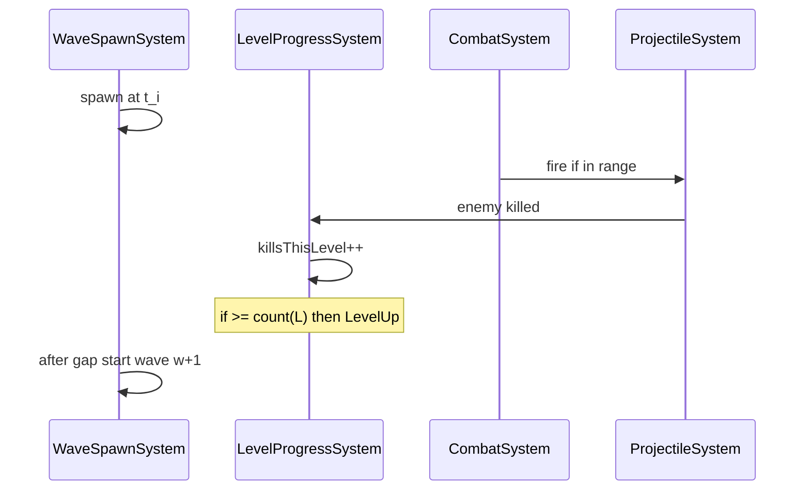

# 架构与源码布局（预期）

> 本文描述 **实现阶段** 目标结构；当前仓库可能仅有文档。

## 目录结构

```text
arcane-defense/
├── index.html
├── src/
│   ├── main.ts                 # Pixi Application 启动
│   ├── app/
│   │   └── GameApp.ts          # 场景挂载、resize
│   ├── game/
│   │   ├── Game.ts             # 状态机：Playing / GameOver / Victory
│   │   ├── systems/
│   │   │   ├── WaveSpawnSystem.ts    # 波次、均匀出怪、WAVE_GAP
│   │   │   ├── LevelProgressSystem.ts # 击杀计数、升级、触发选牌
│   │   │   ├── CombatSystem.ts       # 索敌、开火调度
│   │   │   ├── ProjectileSystem.ts   # 弹道、命中、穿透/爆炸/分裂
│   │   │   └── WallSystem.ts         # 城墙 HP、敌人拆墙
│   │   ├── entities/
│   │   │   ├── Enemy.ts
│   │   │   └── Projectile.ts
│   │   └── data/
│   │       ├── waves.ts        # 与 docs/game/waves.md 一致
│   │       ├── upgrades.ts     # 与 arcane-missile.md 一致
│   │       └── constants.ts    # WAVE_*、伤害、射程等
│   └── ui/
│       ├── Hud.ts              # 等级、波次、城墙 HP
│       └── UpgradePicker.ts    # 三选一；打开时暂停刷怪
├── docs/                       # 设计文档（权威）
└── ...
```

## 系统职责

| 系统                  | 输入               | 输出                                      |
| --------------------- | ------------------ | ----------------------------------------- |
| `WaveSpawnSystem`     | 时间、当前波次 w   | 生成 Enemy；波结束发 `WaveSpawnComplete`  |
| `LevelProgressSystem` | 击杀事件           | 升级时发 `LevelUp`，重置 `killsThisLevel` |
| `CombatSystem`        | 敌人位置、强化状态 | 请求 `ProjectileSystem` 发射              |
| `ProjectileSystem`    | 开火请求           | 伤害事件、爆炸/分裂                       |
| `WallSystem`          | 敌人近墙           | 扣减 `wallHp`；0 则 `GameOver`            |

## 事件流（建议）



## 竖屏适配

- 逻辑坐标系：720×1280。
- `GameApp` 计算 `scale = min(innerW/720, innerH/1280)`，居中 stage。
- 输入：v1 无拖拽；选牌为 UI 点击。

## 文档与代码同步

| 文档                                 | 代码                         |
| ------------------------------------ | ---------------------------- |
| `docs/game/waves.md`                 | `src/game/data/waves.ts`     |
| `docs/game/skills/arcane-missile.md` | `src/game/data/upgrades.ts`  |
| `docs/game/combat.md` 常量表         | `src/game/data/constants.ts` |

**流程**：改数值 → 先 PR 文档 → 再改 data 文件。

## 性能注意（高波次）

- 第 20 波 300 只 / 5s：对象池复用 `Enemy`、`Projectile`。
- 爆炸 AoE：空间划分或限制同屏爆炸结算次数（实现阶段 profiling 后定）。

## 相关文档

- [stack.md](stack.md)
- [tooling.md](tooling.md)
- [../game/overview.md](../game/overview.md)
