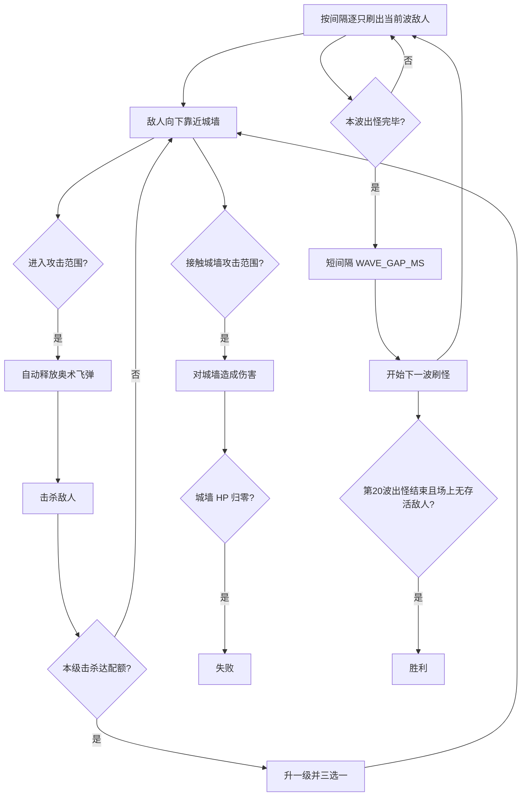

# 游戏概览

## 类型与视角

- **类型**：竖屏塔防式肉鸽割草
- **视角**：竖屏（设计分辨率 720×1280，见 [../dev/stack.md](../dev/stack.md)）
- **操作**：v1 无移动、无手动施法；进入射程后自动攻击

## 场景布局

```text
+----------------------------------+
|          刷怪区（上方）           |  敌人生成点
|                                  |
|          交战区（中部）           |  弹道、AOE
|                                  |
+----------------------------------+
|  城墙线                          |  敌人到达后攻击城墙
|  我方（固定站位）                 |
+----------------------------------+
```

- **上方**：敌人自刷怪区出现，向下移动。
- **下方**：我方单位 + **城墙**；城墙有独立 HP。
- 多波敌人可同时存在于场上（不要求清场才开下一波）。

## 核心循环



两条**独立**时间线：

1. **波次线**：出怪 → 本波刷完 → 间隔 → 下一波（见 [waves.md](waves.md)）。
2. **成长线**：击杀累计 → 达本级配额 → 升级 + 三选一（见 [progression.md](progression.md)）。

## 胜负条件

| 结果     | 条件                                                                                                   |
| -------- | ------------------------------------------------------------------------------------------------------ |
| **失败** | 城墙 HP ≤ 0                                                                                            |
| **胜利** | 存活且第 **20** 波出怪流程全部结束（最后一只已生成，且该波间隔已触发），**且场上无存活敌人**（须清场） |

v1 无局外养成、无存档。

## v1 内容边界

- **技能**：仅 [奥术飞弹](skills/arcane-missile.md)；选牌池可预留「新技能」占位，v1 不实现第二技能。
- **敌人**：单一类型，统一移速 / 生命 / 对墙伤害（数值见 [combat.md](combat.md) 常量表）。
- **波次**：固定 20 波，数量表见 [waves.md](waves.md)。

## 相关文档

- [waves.md](waves.md) — 波次与出怪
- [combat.md](combat.md) — 战斗细节
- [progression.md](progression.md) — 升级与选牌
